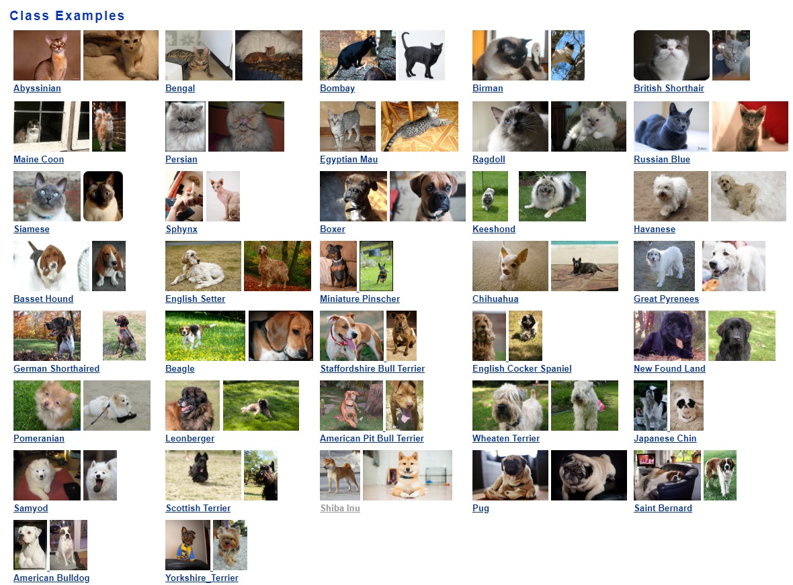

# Transfer learning using mobilenet and the Oxford IIIT Pets Dataset

This repository contains a notebook that will teach you how to train a [mobilenet](https://arxiv.org/abs/1704.04861) model using the [Oxford IIIT Pets Dataset](http://www.robots.ox.ac.uk/~vgg/data/pets/). This dataset contains pictures of 37 different breeds of cats and dogs:



Start this project in Azure Notebooks by clicking on this badge: [](https://notebooks.azure.com/import/gh/jflam/connect-demo)

# Setup

This demo has a number of steps that you'll need to complete to replicate what we did at the Connect() keynote.

## Azure Notebooks Setup

1. Sign up for an account on [Azure Notebooks](https://notebooks.azure.com) by logging in with either a Microsoft Account (e.g., an @outlook.com, an @live.com, or an @hotmail.com address) or an Azure Active Directory organization account (e.g., one from your workplace like @microsoft.com).
1. Open the [Github repository for the demo](https://github.com/Microsoft/connect-petdetector)
1. Scroll down until you see the Azure Notebooks Launch badge  and click on it to clone it into your Azure Notebooks account. You don't need a recursive clone for this import. 
1. If you haven't already, sign up for a [Free Azure Subscription](https://azure.microsoft.com/en-us/free/?v=18.45) which will give you $200 in Azure Credits to spend on training your models using GPUs over the first 30 days of your scription.
1. Open the [Azure Portal](https://portal.azure.com) and create an Ubuntu-based [Data Science Virtual Machine](https://azure.microsoft.com/en-us/services/virtual-machines/data-science-virtual-machines/) (DSVM) using a GPU-powered Azure VM size. We used the [NC6](https://docs.microsoft.com/en-us/azure/virtual-machines/windows/sizes-gpu#nc-series) VM size in the Connect() demo, which is powered by an [NVidia K80 GPU](https://www.nvidia.com/en-gb/data-center/tesla-k80/). VM provisioning takes about 5 minutes and you can track the status in the Azure Portal. 
1. Make sure that you set a username and password (not a SSH key) to log into your DSVM. You will use those same credentials when connecting to your VM from Azure Notebooks.
1. Switch back to the Azure Notebooks Project that you created. 
1. If you are using a log in account issued by your work place or school simply refresh the page to ensure that the DSVM you created is discovered. 
1. Click on the Run drop-down to find and select the DSVM that has now been discovered. Once selected, Click on the Run button again to start it. 
1. Note that if you are using a Microsoft Account (e.g @outlook.com or @gmail.com) then you will need to use the 'Direct Compute' option under the run menu as discovery is not yet enabled for these account types. 
1. In the dialog that appears enter the username and password that you assigned when you created your DSVM. Direct Compute users will also enter the IP of the DSVM. You can find the IP in the Azure Portal. Connections are made on port 8000. 
1. Once the connect dialog is fully populated, click validate to make sure all the connection details are correct, and then click the Run button on the dialog. This will open the Jupyter treeview of your project. 
1. Double-click on the `setup.ipynb` file to launch the setup notebook.
1. Ensure that you are targetting the `Python 3.6 - AzureML` kernel by selecting it from the `Kernel > Change Kernel` menu.
1. Follow the instructions in the notebook. The configuration cell contains a
   number of parameters that you will need to set. You must set a value for each empty paramater below. You will need to create a Azure storage account if you do not already have one.
```python
class AMLConfig:
    pass

AMLConfig.workspace_name           = ''
AMLConfig.experiment_name          = ''
AMLConfig.resource_group           = ''
AMLConfig.compute_name             = ''
AMLConfig.training_script_filename = 'train.py'
AMLConfig.scoring_script_filename  = 'score.py'
AMLConfig.subscription_id          = ''
AMLConfig.storage_account_name     = ''
AMLConfig.storage_account_key      = ''
AMLConfig.datastore_name           = 'default'
AMLConfig.container_name           = 'default'
AMLConfig.images_dir               = 'images'

AML = AMLConfig()
```
10. The `setup` notebook will download the dataset, transform the file
   layout into a form that Tensorflow can understand, and generate a number of
   intermediate _bottleneck_ files that contain pre-computed weights that will
   be used later when we apply transfer learning to retrain only the final layer
    in the model using the labelled images in the pet dataset. It also uploads
    the images into an AML Datastore that is used by the AML Compute cluster
    that is created at the end of the setup script.

# Visual Studio Code Setup

1. Download and install [Visual Studio
   Code](https://code.visualstudio.com/download)
1. Run Visual Studio Code and click on the Extensions tab. Search for and
   install the following extensions: `Python`, `Azure Machine Learning`,
   `Intellicode`
1. Install the latest [Anaconda Python
   distribution](https://www.anaconda.com/download)
1. Open a Terminal Window and run the following three commands to create a new
   conda environment:

```
conda create -n py36 python=3.6 jupyter pillow matplotlib numpy tensorflow=1.11

conda activate py36

pip install --upgrade azureml-sdk
```
5. Clone the [pet detector Github
   repo](https://github.com/Microsoft/connect-petdetector) onto your machine.

```
git clone https://github.com/Microsoft/connect-petdetector
```

6. Navigate to the directory that contains your git repo and type `code .` to
   launch Visual Studio Code.
